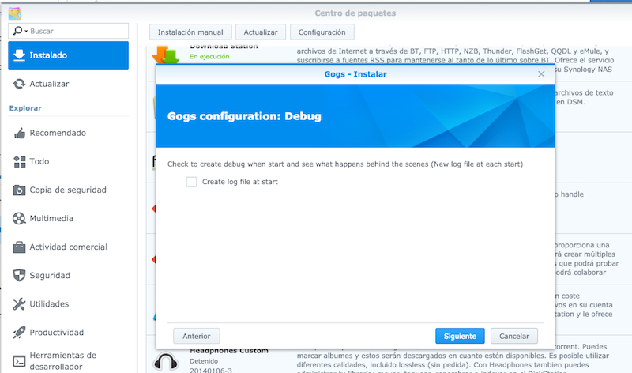
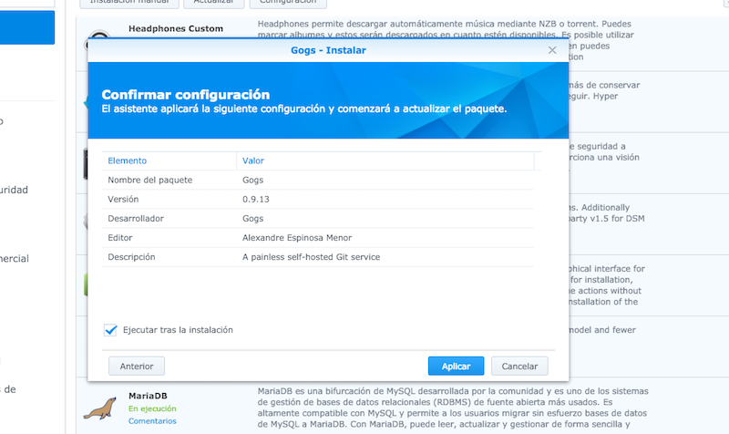
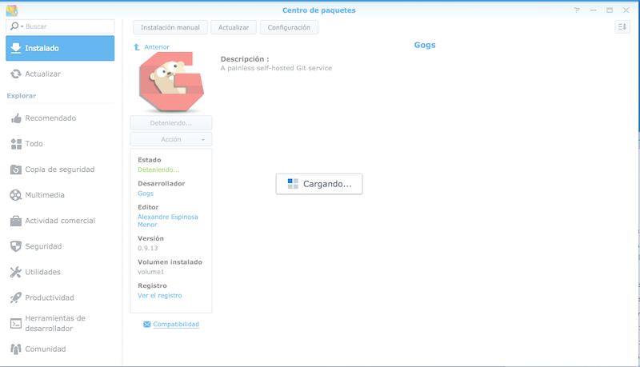
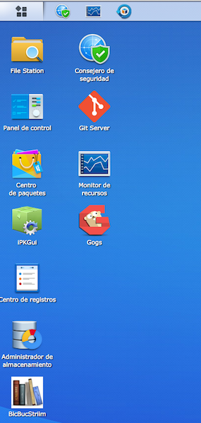

# gogs-spk

[Gogs](https://gogs.io) (Go Git Service) SPK package ([Synology PacKages](https://www.synology.com/en-us/dsm/app_packages))

Install Gogs into a Synology NAS.

## Requirements

<sub>this package, to see Gogs requirements check https://gogs.io</sub>

* armv7 (Tested only with DS213j, Marvell Armada 370)
* MariaDB
* Git Server

## Usage

Change **Package Center -> Trust Level** to **Any Publisher** and import manually the package from **Manual install**.
Finally, install with Gogs web installation.

## To use with another arch

Download the binary from https://gogs.io/docs/installation/install_from_binary, replace the content from **1_create_package/gogs** directory and exec create_spk.sh:

```alex@vostok:/Volumes/HD/Development/synology/gogs-spk(master)$ rm -rf 1_create_package/gogs/ && tar zxvf gogs_v0.9.13_linux_386.tar.gz -C 1_create_package/```

```$ sh create_spk.sh```


## Compiled from source

Suggested by [hirakujira](https://github.com/hirakujira)

```
GOOS=linux GOARCH=arm GOARM=7 go get -u github.com/gogits/gogs
```


## Screenshots










Gogs screenshots
https://github.com/gogits/gogs


## ToDo

- Don't force to use Git Server and MariaDB (PostgreSQL? Gogs ARM version haven't Sqlite/TiDB)
- Support to archs (and DBs)
- Don't use **root** user and create and use **gogs** user, if possible
